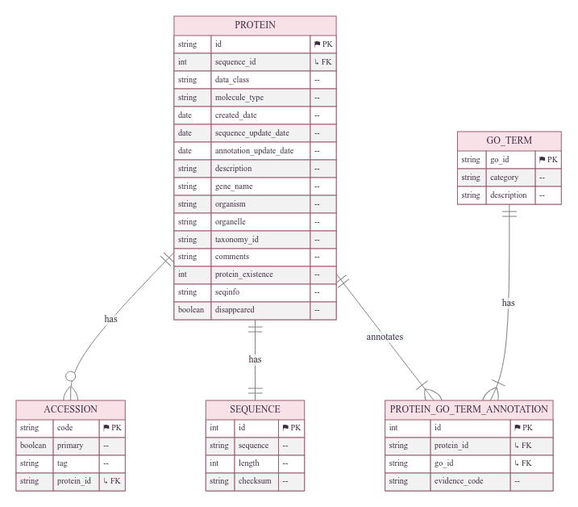

Data Source
============

The data used in FANTASIA originates from the **Protein Information System (PIS)**, a structured and publicly available information system designed to facilitate large-scale functional annotation and protein-related analyses. The system is accessible at [PISGitHub]_.

FANTASIA supports three distinct lookup tables containing UniProt protein entries and corresponding Gene Ontology (GO) annotations, each adapted for different analytical needs:

- **2022 dataset**: Derived from the goPredSim project, it contains over 2 million annotations, including those inferred electronically (IEA). This dataset provides the most comprehensive coverage but includes annotations with lower evidence confidence.
- **GOA2024 dataset**: Contains UniProt entries with embeddings generated using ProtT5 and ESM2 models. It stores all UniProt entries and their computationally predicted annotations.
- **2025 Non-Computational dataset**: This is the default lookup table used in FANTASIA. It includes only annotations supported by experimental evidence (e.g., EXP, IDA, IPI, IMP, IGI, IEP, TAS, IC), extracted directly from the UniProt API in April 2025. This ensures a high-confidence annotation set for downstream benchmarking and interpretation.

> **Note**: Although the 2022 dataset offers broader annotation coverage, current FANTASIA workflows focus on experimental evidence to ensure annotation quality and interpretability.

These relational databases offer several advantages:

- **Enhanced Data Traceability**: Metadata integration enables provenance tracking and reproducibility.
- **Relational Algebra Support**: Structured data allows advanced queries and relationship-based analyses.
- **Scalability & Expandability**: The system can integrate new data sources (e.g., structural, evolutionary, or experimental).
- **Cross-Referencing with Structural Data**: Enables combined sequence- and structure-based functional analyses.

All datasets are publicly available on Zenodo [ZenodoRef]_, and access is provided via SQL queries using provided credentials. This setup ensures transparency, modularity, and reproducibility for large-scale protein annotation studies.

References
^^^^^^^^^^

.. [PISGitHub] Protein Information System (PIS) GitHub Repository, available at: `GitHub <https://github.com/frapercan/protein_information_system>`_.

.. [ZenodoRef] Reference database for FANTASIA, available at: `Zenodo <https://zenodo.org/records/15133346>`_.
