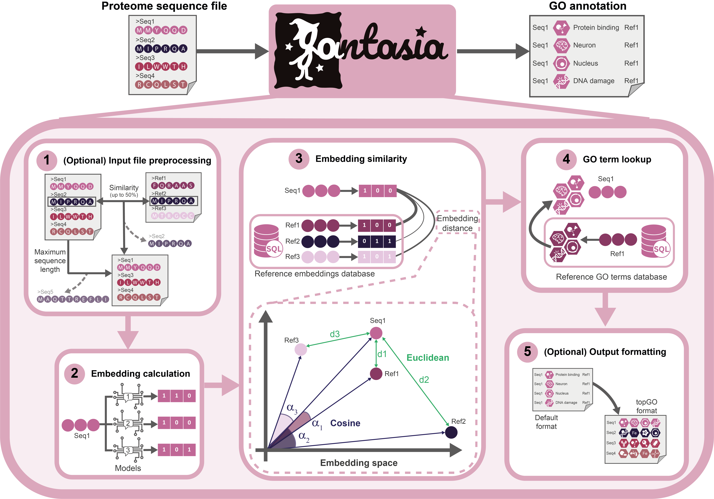

.. _methods:

Methods
=======

FANTASIA is a reimplementation of the original GOPredSim algorithm [1]_ for full proteome annotation, executing GO transference based on protein embedding similarity. Building on the original method, our pipeline enhances usability by **improving scalability** for full proteomes, streamlining installation with **minimized dependency conflicts**, and providing an intuitive command-line interface that simplifies parameter customization.

Step 1: Setup and Input File Preprocessing
------------------------------------------

**NOTE**: In the original implementation, sequences longer than 5000 amino acids had to be removed when using the ProtTrans model. While this requirement no longer applies in FANTASIA, we still provide this option. Users can choose to remove long sequences if desired.

**If redundancy removal is required in the lookup table**, sequence similarity-based filtering can be applied using the widely acknowledged tool **CD-HIT** [2]_, with a minimum identity threshold of 50%. We do not recommend using thresholds below this limit, as the intended use is to exclude sequences that are overly very similar to those in the annotated reference database.

Before computing distances between embeddings, the query input dataset is concatenated with the reference table, and clustering is performed. Then, for each query embedding, a comparison is made against the entire reference table. During this process, embeddings corresponding to sequences belonging to the same cluster as the query are excluded, ensuring that no matches (hits) occur with proteins that exceed the specified sequence identity threshold.

**IMPORTANT**: The use of these options depends on the intended application. Sequence similarity-based removal is recommended for benchmarking procedures but should not be performed for proteome functional annotation. For details on parameter selection for different applications, refer to the pipeline documentation.

Step 2: Embedding Computation
-----------------------------

FANTASIA supports batch processing of protein sequences to leverage GPU efficiency during embedding computation. However, to ensure maximum embedding fidelity, especially with transformer-based protein language models (PLMs), embeddings are computed with batch_size = 1 by default. This decision avoids the introduction of artifacts caused by sequence padding and special tokens, which can distort representations when multiple sequences are processed together. Each protein is therefore embedded in isolation, producing clean and context-independent vectors. Supported models include ProtT5 [3]_, ESM2 [4]_, and ProstT5 [5]_, and results are stored in HDF5 format for later use.

Step 3: Embedding Similarity
----------------------------

FANTASIA then computes the distance between each input sequence embedding and those in the reference vector database [6]_. The reference database is managed with PostgreSQL, allowing fast retrieval of results. It contains, for each reference protein, its metadata, GO term annotations, amino acid sequence, and precomputed embeddings for the supported pLMs.

By default, Euclidean distance (:math:`d_e`) between embeddings :math:`n` and :math:`m` for a model with an embedding dimensionality :math:`s` is computed with the following formula:

.. math::
   d_e(n, m) = \sum_{i=1}^{s} (n_i - m_i)^2

where :math:`s` represents the number of dimensions in the embedding space, which varies depending on the selected protein language model: :math:`s = 1024` for ProtT5 and ProstT5, and :math:`s = 320` for ESM2.

Alternatively, cosine similarity (:math:`d_c`) can be selected as a parameter, using the formula:

.. math::
   d_c(n, m) = \frac{\sum_{i=1}^{s} n_i m_i}{\sqrt{\sum_{i=1}^{s} n_i^2} \cdot \sqrt{\sum_{i=1}^{s} m_i^2}}

Step 4: GO Transfer
-------------------

FANTASIA  by default transfers GO terms from the :math:`k` proteins providing the closest embedding(s) hit(s) in the database. Additionally, the user can define a distance threshold for each model that determines the maximum allowed distance between query and reference embeddings. These thresholds have not been fully optimised and defaults are selected as reliable options (they cannot be "0"). By default, only the closest hit (:math:`k=1`) is used, regardless of its distance to the query embedding. 

Step 5: Output Description and Optional Formatting
--------------------------------------------------

The output of FANTASIA consists of a comma-separated values (CSV) file named `results.csv`, containing the **functional annotations** predicted for each query sequence. The table includes the following columns:

1. `accession`: Sequence identifier of the query protein.
2. `go_id`: Gene Ontology (GO) term identifier.
3. `category`: GO domain (F: Molecular Function, P: Biological Process, C: Cellular Component).
4. `evidence_code`: Evidence code of the reference annotation (e.g., EXP, IDA, TAS).
5. `go_description`: Description of the GO term.
6. `distance`: Embedding distance between query and reference (either Euclidean or cosine).
7. `reliability_index`: Confidence score computed from the distance metric (see below).
8. `model_name`: Name of the embedding model used (e.g., prot_t5, esm).
9. `protein_id`: Internal ID of the reference protein providing the annotation.
10. `organism`: Scientific name of the reference protein's organism.
11. `gene_name`: Gene name (if available) of the reference protein.
12. `identity`: Percentage identity from global alignment (Parasail).
13. `similarity`: Percentage similarity from global alignment (Parasail).
14. `alignment_score`: Raw alignment score.
15. `gaps_percentage`: Proportion of gaps in the alignment.
16. `alignment_length`: Length of aligned region.
17. `length_query`: Length of the query sequence.
18. `length_reference`: Length of the reference sequence.
19. `support_count`: Number of times this GO term was supported across hits for the query.
20. `collapsed_support`: Support inherited from more general (ancestor) GO terms.
21. `n_collapsed_terms`: Number of collapsed terms grouped under the selected leaf.
22. `collapsed_terms`: List of collapsed GO terms grouped under this annotation (if any).

Each row corresponds to a **leaf GO term** identified for a given query, and is **filtered to retain only the highest reliability annotation** per `(accession, go_id, model)` triplet.

Optional outputs:

- `results_topgo.tsv`: TSV file with one row per query, containing comma-separated GO terms, compatible with `topGO`.
- `raw_results.csv`: Raw unfiltered annotation table prior to RI filtering and GO collapsing.
- `embeddings.h5`: Embeddings and sequence data used for the lookup process.

All output files are stored in a timestamped subdirectory under `~/fantasia/experiments/`.

Reliability Index (RI)
^^^^^^^^^^^^^^^^^^^^^^

The reliability index (RI) is a transformation of the distance into a similarity scale, making it easier to "interpret the confidence" in the functional annotation. This approach of scaling distance into a similarity metric follows principles previously established in Littmann et al. (2021) _[1]. FANTASIA supports two distinct RI formulations, depending on the selected distance metric:

- If using the **direct similarity measure**, applied to cosine similarity (:math:`d_c`), RI is computed as:

  .. math::
     RI = 1 - d_c(q, n_i)

  where :math:`d_c(q, n_i)` represents the cosine distance between the query embedding :math:`q` and its closest reference :math:`n_i`.

- If using the **inverse similarity transformation**, applied to Euclidean distance (:math:`d_e`), RI is defined as:

  .. math::
     RI = \frac{0.5}{0.5 + d_e(q, n_i)}

  where lower Euclidean distances yield higher confidence scores.

While both formulations produce values ranging from 0 to 1, they are **NOT directly comparable**, as they capture confidence in different ways. Users should **exercise CAUTION when interpreting RI** scores across different similarity metrics.

Additionally, **the Euclidean distance IS NOT inherently comparable across different protein language models**, as it depends on the magnitude of the embedding vectors generated by each model. In contrast, the **cosine similarity metric** is more suitable for cross-model comparisons, as it primarily captures the relative orientation of embeddings rather than their absolute magnitude.

GO Term Filtering
^^^^^^^^^^^^^^^^^

After annotation, FANTASIA does **not** collapse annotations directly by `(accession, go_id)` pairs. Instead, it preserves all GO term predictions per query and embedding model, then calculates:

- **Support Count**: Number of hits that supported the same GO term.
- **Reliability Index (RI)**: Confidence score derived from the embedding distance.

These metrics are used to prioritize the most informative annotations in later steps, but all predictions above the similarity threshold are retained for downstream processing.

Leaf Term Selection and Collapsing
^^^^^^^^^^^^^^^^^^^^^^^^^^^^^^^^^^

To improve annotation specificity, FANTASIA performs a **leaf term selection** per query and model. Using the GO graph structure ), it identifies GO terms that are **not ancestors** of any other predicted term in the same set—these are considered **leaf terms**.

Once leaf terms are selected, broader (ancestor) terms are **collapsed** into the leaf they support. The contribution of these collapsed terms is quantified via:

- **collapsed_support**: Total number of ancestor hits merged into the leaf.
- **n_collapsed_terms**: Number of distinct GO terms collapsed.
- **collapsed_terms**: List of the GO terms absorbed under the selected leaf.

This process reduces redundancy and ensures that output annotations reflect the most specific, non-overlapping functional descriptions possible.

Pairwise Sequence Alignment
======================================

To provide additional validation and interpretability of functional annotation results, FANTASIA includes an optional **global pairwise alignment** step using the `Parasail` library [9]_. For each predicted annotation, the system aligns the query and reference protein sequences using the **Needleman-Wunsch algorithm** with the following parameters:

- Substitution matrix: **BLOSUM62**
- Gap open penalty: **10**
- Gap extension penalty: **1**

This alignment is performed via `parasail.nw_trace_striped_32`, an efficient SIMD-accelerated implementation of global alignment.

Importantly, this alignment is **not used to decide functional transfer**, which is entirely based on embedding similarity. Instead, it serves to **quantify sequence-level agreement** between each query and the top-scoring reference supporting a GO term.

The following alignment-derived metrics are computed and included in the `results.csv` output:

- `identity`: Percentage of identical amino acids in the alignment.
- `similarity`: Percentage of similar residues according to BLOSUM62 categories.
- `alignment_score`: Raw alignment score assigned by Parasail.
- `gaps_percentage`: Proportion of gaps in the alignment relative to its total length.
- `alignment_length`: Total length of the aligned region.
- `length_query` and `length_reference`: Original sequence lengths prior to alignment.

This step is executed automatically during the post-processing stage and does **not require user configuration**. These metrics enable further filtering, interpretation of transfer reliability, or benchmarking against homology-based approaches.

TopGO Compatibility
^^^^^^^^^^^^^^^^^^^^^^
By default, FANTASIA also converts the standard output file into the input format required for [7]_'s GO enrichment analysis [8]_, facilitating its integration into broader biological workflows. This feature can be disabled by the user if desired.

References
--------------------------------------------------

References
----------

.. [1] M. Littmann et al., "Embeddings from deep learning transfer GO annotations beyond homology," *Scientific Reports*, 11, 1160 (2021). https://doi.org/10.1038/s41598-020-80786-0

.. [2] M. Steinegger and J. Söding, "MMseqs2 enables sensitive protein sequence searching for the analysis of massive data sets," *Nature Biotechnology*, 35(11), 1026–1028 (2017). https://doi.org/10.1038/nbt.3988

.. [3] M. Heinzinger et al., "Modeling aspects of the language of life through transfer-learning protein sequences," *BMC Bioinformatics*, 20, 723 (2019). https://doi.org/10.1186/s12859-019-3220-8

.. [4] Z. Lin et al., "Evolutionary-scale prediction of atomic-level protein structure with a language model," *Science*, 379(6637), 1123–1130 (2023). https://doi.org/10.1126/science.ade2574

.. [5] M. Heinzinger et al., "Bilingual language model for protein sequence and structure," *NARGAB*, 6(4), (2024). https://doi.org/10.1093/nargab/lqae059

.. [6] FANTASIA Reference Database. Zenodo repository (2024). https://zenodo.org/records/14864851

.. [7] T. Tang et al., "GOATOOLS: A Python library for Gene Ontology analyses", https://github.com/tanghaibao/goatools

.. [8] A. Alexa and J. Rahnenführer, "topGO: Enrichment Analysis for Gene Ontology," *R package version*, (2017). https://bioconductor.org/packages/release/bioc/html/topGO.html

.. [9] J. Daily, “Parasail: SIMD C library for global, semi-global, and local pairwise sequence alignments,” *BMC Bioinformatics*, 17, 81 (2016). https://doi.org/10.1186/s12859-016-0930-z