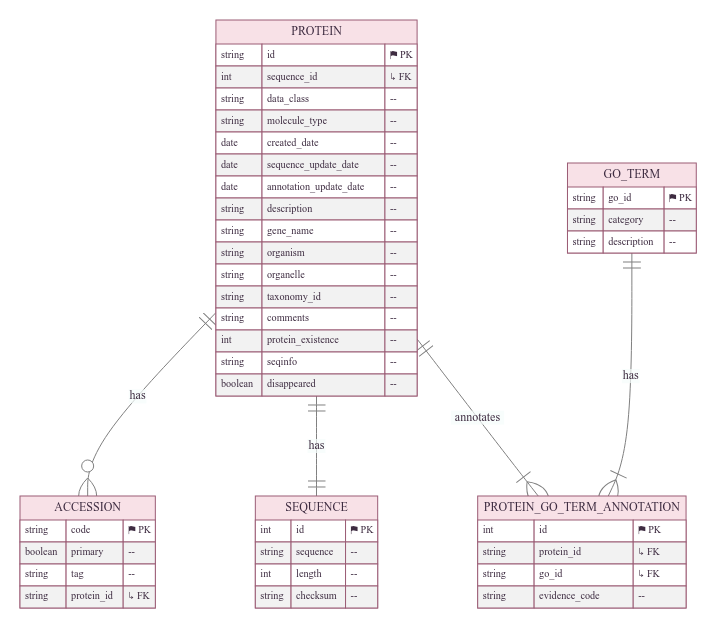

Database and Similarity Search
==============================

Scope
-----
This page describes the data dependencies and database-backed similarity search
used by **FANTASIA v4**. It does not cover scoring or ontology-specific logic.

Data Requirements
-----------------
FANTASIA **requires** two distinct data streams:

- **Input (query)**: user-provided sequences to annotate (FASTA) or precomputed
  query embeddings (HDF5).
- **Reference (lookup table)**: curated embeddings and GO annotations generated in
  the **Protein Information System (PIS)** at CBBIO [1]_, a structured information
  system designed for large-scale functional annotation and protein-related analyses.

Reference Datasets
------------------
Two packaged reference datasets are available; select one depending on your analysis needs:

- **Main Reference (last layer, default)**
  Embeddings extracted only from the **final hidden layer** of each PLM.
  Recommended for most annotation tasks (smaller, faster to load).
  *Config URL*: https://zenodo.org/records/17167843/files/FANTASIA_UniProt_Sep2025_Last_ExpOnly.dump?download=1

- **Multilayer Reference (intermediate + final layers)**
  Embeddings extracted from **multiple hidden layers** (including intermediate and final).
  Suitable for comparative and exploratory analyses requiring layer-wise representations.
  *Config URL*: https://zenodo.org/records/17151847/files/FANTASIA_UniProt_Sep2025_Final+Interm_ExpOnly.dump?download=1

Provisioning Reference Data
---------------------------
During initialization, FANTASIA downloads the packaged **reference embeddings** and
**loads** them into the database used by PIS. This step prepares the lookup tables
before running the pipeline.

Initialize FANTASIA environment
~~~~~~~~~~~~~~~~~~~~~~~~~~~~~~~
- Read YAML configuration.
- Download the reference embeddings dump (if URL provided).
- Ensure base directories exist.

Use ``--embeddings_url`` to override the dataset URL from YAML.

.. code-block:: text

   options:
     -h, --help            show this help message and exit
     --config CONFIG       Path to the YAML configuration file. Default: './fantasia/config.yaml'.
     --embeddings_url EMBEDDINGS_URL
                           Override the embeddings dump URL (otherwise taken from YAML).
     --base_directory BASE_DIRECTORY
                           Base directory used to place the embeddings/experiments folders.
     --log_path LOG_PATH   Path or directory for logs. If a directory, a 'Logs_<timestamp>.log' file is created inside.

Examples
~~~~~~~~

.. code-block:: bash

   # Initialize with default from YAML (Final layer only)
   fantasia initialize --config ./fantasia/config.yaml

   # Explicitly use Final layer only (smaller, faster)
   fantasia initialize --config ./fantasia/config.yaml \
     --embeddings_url https://zenodo.org/records/17167843/files/FANTASIA_UniProt_Sep2025_Last_ExpOnly.dump?download=1

   # Explicitly use Final + intermediate layers (larger, more detailed)
   fantasia initialize --config ./fantasia/config.yaml \
     --embeddings_url https://zenodo.org/records/17151847/files/FANTASIA_UniProt_Sep2025_Final+Interm_ExpOnly.dump?download=1

Query Embeddings (experiment-local)
-----------------------------------
When running the full pipeline, the embedding stage writes **per-layer** query
embeddings into a single HDF5 file (``embeddings.h5``) under the experiment folder, using:

``/accession_<ID>/type_<embedding_type_id>/layer_<k>/embedding``

Each layer group includes a ``shape`` attribute; the accession group may include one
``sequence`` dataset. In **lookup-only** mode you can point directly to an existing HDF5.

Database-Backed Similarity Search
---------------------------------
FANTASIA uses PIS (PostgreSQL + SQLAlchemy ORM) as the authoritative reference
source. Before distance computation, the lookup stage **materializes per-model
reference arrays in memory** (IDs + dense vectors) and preloads GO annotations.

Execution flow (layer-aware):

1. Resolve embedding *types*: match enabled model keys from the YAML config to
   types available in PIS (pulling per-model `distance_threshold` and `batch_size`).
2. Build lookup tables in memory: per model, load `ids` and `embeddings`
   (optionally applying taxonomy include/exclude filters).
3. Iterate query HDF5: for each accession, for each type and each `layer_k`
   present under ``/accession_*/type_*/layer_*/embedding``, enqueue a task
   (legacy format without layers is also supported).
4. Distance kernels: compute **cosine** or **euclidean** distances on GPU
   (PyTorch) or CPU (SciPy), as configured via `use_gpu`.
5. Neighbor selection: if a per-model `distance_threshold` is set, filter by
   threshold and then cap to `limit_per_entry`; otherwise, take the top
   `limit_per_entry` nearest neighbors.
6. Write outputs: store compact RAW per (model, layer, GO). Post-processing
   computes reliability, scores, and final CSV/TSV artifacts. Results are
   **not** written back into PIS.

Configuration notes:

- Distance metric is read from: ``embedding.distance_metric`` (``euclidean`` | ``cosine``).
- Defaults: ``limit_per_entry: 5`` unless overridden.
- Redundancy (optional): set ``redundancy_filter > 0`` to enable MMseqs2 clustering and exclude same-cluster neighbors during selection.

Configuration Surfaces (DB & Similarity Search only)
----------------------------------------------------

**Reference provisioning**

- ``embeddings_url`` — URL of the reference lookup dataset

**Lookup (similarity search)**

- ``embedding.distance_metric`` — ``euclidean`` | ``cosine`` (metric used by the lookup stage).
- ``limit_per_entry`` — number of nearest neighbors retained per query (per model/layer).
- ``batch_size`` — lookup processing batch size for distance computation.
- ``redundancy_filter`` / ``alignment_coverage`` — optional MMseqs2-based redundancy control.
- ``taxonomy_ids_to_exclude`` / ``taxonomy_ids_included_exclusively`` / ``get_descendants`` — taxonomy filters.
- ``embedding.models.<ModelKey>.distance_threshold`` — optional per-model cutoff applied before capping to ``limit_per_entry``.

**Database (PIS)**

- ``DB_HOST``, ``DB_PORT``, ``DB_NAME``, ``DB_USERNAME``, ``DB_PASSWORD`` — PostgreSQL connection used by PIS.

References
----------
.. [1] Protein Information System (PIS) — CBBIO. Public repository: https://github.com/CBBIO/protein-information-system
